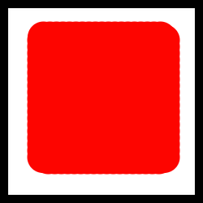
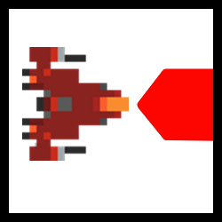

# Stars Arcade

**Stars Arcade** is an exciting arcade-style shooter game made in Java, inspired by Asteroids (1979). Survive incoming meteors, equip and use powerful skills, and aim for the highest score.

## Features
- **Infinite Playability**: The game will continue indefinitely until your ship breaks.
- **Customizable Skills**: Equip up to four abilities from a pool of unique options.
- **Difficulty Ramping**: Survive increasingly difficult waves of meteors. As time passes, more meteors will spawn in each incoming group.

## How to Run
1. **Install the latest version of Java Runtime Environment (JRE)** if it's not already installed. You can download it [here](https://www.java.com/en/download/).
2. Clone this repository:
   ```bash
   git clone https://github.com/cc0407/Stars-Arcade.git
   ```
3. Navigate to the `eclipse-workspace_Stars` directory:
   ```bash
   cd eclipse-workspace_Stars
   ```
4. Run the game using the `.jar` file:
   ```bash
   java -jar Stars-Arcade.jar
   ```
   > **Note**: The `Stars-Arcade.jar` file **must** remain in the `eclipse-workspace_Stars` directory to function correctly.

## How to Play

### Controls
| Action  | Button |
|---------|--------|
| Up      | W      |
| Down    | S      |
| Left    | A      |
| Right   | D      |
| Fire    | Space  |
| Skill 1 | 1      |
| Skill 2 | 2      |
| Skill 3 | 3      |
| Skill 4 | 4      |

### Skills
| Icon                                                        | Skill           | Description                                                                                                                                     | Duration                                     | Cooldown |
|-------------------------------------------------------------|-----------------|-------------------------------------------------------------------------------------------------------------------------------------------------|----------------------------------------------|----------|
|        | **Shield**      | Forcefield that protects your ship from damage.                                                                                                 | 5 sec                                        | 10 sec   |
|          | **Boost**       | Afterburners for your ship, increasing speed by 1.5x.                                                                                           | 10 sec                                       | 20 sec   |
|     | **Multi Shot**  | Additional wing guns. Allows the ship to fire three missiles instead of one.                                                                    | 10 sec                                       | 20 sec   |
|  | **Proximity Mine** | Energy mine that hovers in place. Mine halves in size after destroying a meteor before dissipating completely. Each mine can destroy 4 meteors. | 4 collisions                                 | 20 sec   |
|       | **Mega Shot**   | Releases a powerful beam after charging, dealing massive damage in front of the ship.                                                           | **Charge-Up**: 20 sec<br>**Duration**: 5 sec | 50 sec   |

### Skill Selection
1. Open the **Skills Tab** from the main menu.
2. Select a skill from the left side of the menu to view its description and cooldown.
3. Click on a slot on the right side to assign the selected skill to your active loadout.
4. Experiment with different combinations to find the best strategy for your playstyle.

## Tips and Tricks
- **Conserve Skills**: Use skills strategically, as each has a cooldown period.
- **Stay Mobile**: Keep moving to avoid getting overwhelmed by meteors.
- **Experiment**: Try out different skills to find what works best for you.

## Roadmap
Exciting features planned for future updates:
- **New Meteor Textures**: Introduce varied and detailed meteor designs.
- **Power-Up Sounds**: Add distinct audio feedback for each power-up.
- **Memory Optimizations**: Improve performance for smoother gameplay.
- **Local Highscores**: Track and display your best runs on a leaderboard.

## Contributing
Contributions are welcome! If you have suggestions for improvements or new features, feel free to:
1. Fork this repository.
2. Make your changes.
3. Submit a pull request.

## License
This project is licensed under the MIT License.